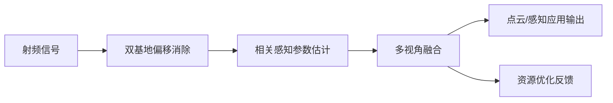

## 摘要
网络化感知通过联合利用多个分布式节点的观测数据，对于释放集成感知与通信（ISAC）的全部感知潜力至关重要。本文介绍了多UE感知，一种面向未来感知移动网络的新的网络化感知范式，该范式利用了分布式用户设备（UE）与共同目标交互时自然产生的相关感知观测。文中展示了具有代表性的上行链路、下行链路和混合感知架构，以及一个涵盖同步、相关感知参数估计和感知融合的多视角信号处理框架。还讨论了关键开放挑战，包括相关建模、目标关联、感知信息压缩以及通信与感知协同优化。

## Abstract
Networked sensing, which jointly exploits observations from multiple distributed nodes, is essential for unlocking the full sensing potential of integrated sensing and communications (ISAC). This article introduces multi-UE sensing, a new networked sensing paradigm for future perceptive mobile networks that exploits the correlated sensing observations naturally arising from distributed user equipment devices (UEs) interacting with common targets. Representative uplink, downlink, and hybrid sensing architectures are presented, together with a multi-view signal processing framework encompassing synchronization, correlation-aware parameter estimation, and sensing fusion. Key open challenges, including correlation modelling, target association, sensing information compression, and communication-sensing co-optimization, are also discussed.

---

## 论文详细总结（自动生成）

## 论文核心问题与整体含义（研究动机和背景）

- **核心问题**：现有网络化感知主要依赖多基站协同接收（multi-CoopRx）架构，需要密集部署基站、严格的基站间同步、干扰管理和高容量回传链路，导致系统复杂度高、部署成本大、可扩展性差；同时，现有研究忽视了分布在网络中的海量用户设备（UE）的感知潜力。
- **研究动机**：未来6G移动网络将从以通信为中心的基础设施演进为具备感知能力（ISAC）的感知移动网络（PMN）。网络化感知是释放ISAC全面感知潜力的关键，而现代无线网络天然是多接入系统，拥有大量地理分布的UE，这些UE与共同目标交互时会产生**相关感知观测**——这一重要的网络属性长期未被充分挖掘。
- **整体含义**：本文提出**多UE网络化感知（multi-UE sensing）**这一新范式，利用分布式UE对共同目标的多视角观测和内在相关性，以单基站即可完成感知融合，显著降低对基础设施协同的要求，与多接入网络的天然特性相契合，为大规模、成本有效的感知网络提供了新的演进路径。

## 方法论：核心思想、关键技术细节与算法流程

### 核心思想
- 利用**多UE空间分集**：地理位置相近的UE从不同空间视角观测或照射共同目标，生成各异的但相关的感知参数（延迟、多普勒、角度、幅度等）。
- 利用**相关性**：这种相关性源于共同目标、感知几何和环境交互，可作为参数估计、目标关联和多视角融合的先验信息。
- 融合**非相干与相干处理**：非相干处理利用观测多样性与相关性，无需UE间严格同步；相干处理可提供SNR提升、带宽聚合和分布式孔径等增益，但需要精确同步与校准。

### 三种代表性架构
1. **上行链路感知（Uplink-Only）**：多个UE同时向BS发送通信信号，BS联合利用直接和反射信号进行感知。每个UE-BS对构成双基地链路，通过发射端空间分集实现多视角观测。该架构最贴合现有蜂窝协议，实现简单、可扩展性好。
2. **下行链路辅助感知（Downlink-Assisted）**：分布式UE接收BS下行信号，本地提取延迟、多普勒、角度等特征，将压缩测量数据或高层特征上报至BS融合，显著降低通信开销。利用下行广播特性可同时服务大量UE，空间采样更密集、几何约束更强。
3. **混合感知（Hybrid）**：联合利用上行和下行感知信息，弥补单一架构的不足（如FDD上下行频段不同、资源配置不同等），提供更多可观测路径，增强目标可观测性、覆盖鲁棒性和目标分离能力。

### 多址接入方式的影响
- 论文分析了**TDMA、OFDMA、SDMA**三种多址方案对多UE感知的影响（如表1所示）：
  - TDMA：提供时间分集，改进多普勒分辨率，但多视角并发性受限；
  - OFDMA：提供频率域灵活采样和带宽聚合，提升延迟分辨率，但受频谱碎片化影响；
  - SDMA：提供空间/角度分集和虚拟孔径增益，但存在用户间干扰和较高处理复杂度。
- 提出了**感知感知多址接入设计（sensing-aware multiple-access design）**：如OFDMA中，局部子载波块利于跨UE带宽拼接，实现宽带感知；交织子载波分配则提高频域采样多样性，扩大无模糊延迟估计范围。

### 信号处理框架
- 如图2所示，处理流程包含以下核心模块：

1. **同步与双基地偏移消除（Synchronization and Bistatic Offsets Cancellation）**：
   - 多UE系统中，时钟偏移（载波频偏、相偏、时偏）随UE变化且可能远大于目标引起的待测参数变化。
   - 关键技术：基于子载波处理的**互相关（cross-correlation）**和**信号比处理（signal-ratio processing）**，利用收发机共同偏移消除UE相关偏移，同时保留相对延迟、多普勒和角度信息。
   - 参考信号可来自单天线/单子载波、主路径或信号子空间。
   - 代价：绝对参数通常被转化为相对量，需要已知参考路径或先验信息恢复绝对值；且需设计方法在消除同步误差的同时保留目标相关的几何相关结构（引用[9]的成功案例）。

2. **相关感知参数估计（Correlation-aware Parameter Estimation）**：
   - 多UE观测中的感知参数并非独立，而是受共同目标几何和运动约束而相互关联。
   - 表2总结了四类相关感知估计技术：
     - **几何约束与结构化稀疏恢复**（几何拟合、联合稀疏性、MMV-CS、稀疏贝叶斯学习）：利用共同目标跨UE的共享支撑和双基地几何关系，适合有限感知资源场景，但几何关系常为高度非线性、存在网格失配问题；
     - **统计估计方法**（联合ML、MAP、贝叶斯估计与跟踪）：系统性地纳入目标统计信息和UE位置等先验，计算代价较高；
     - **子空间方法**（联合MUSIC、分布式MUSIC、ESPRIT、张量ESPRIT）：利用公共信号子空间和协方差结构获得高分辨率，但需要足够的SNR和快照数，难以利用统计先验；
     - **学习辅助估计**（深度展开、图神经网络、物理信息学习）：能够建模复杂时空相关性，但依赖训练数据与泛化能力。
   - 图3展示了采用**贝叶斯压缩感知**对多个UE的传播延迟相关性进行联合建模后的估计精度提升。

3. **多视角融合（Multi-view Fusion）**：
   - 融合层级可分为**测量级**（延迟/多普勒/角度参数联合处理）、**特征级**（距离-多普勒图、占据图或学习嵌入）和**语义级**（目标身份、行为意图、场景描述）。
   - 测量级保留信息最多但需要精确参数关联；特征级在感知性能和通信开销间实现较好平衡；语义级开销最低，更适合实际部署。
   - 实现技术：贝叶斯推断、因子图和消息传递、图神经网络与学习辅助融合等。

## 实验设计

- **说明**：本文为**观点/综述导向的文章**，不包含传统意义上的系统实验设计，没有标准数据集和benchmark体系。
- **仿真示例**：文中仅给出一个仿真结果（图3），演示上行多UE感知中相关感知参数估计的增益。该仿真基于论文[9]的OFDMA系统设置，SNR=10 dB，每个UE占用128个局部子载波，将**联合处理的UE数量**（1至16个）作为变量，绘制延迟和多普勒估计精度曲线。
- **对比方法**：将联合处理多UE信号的方案与**独立逐UE处理**的基线方案进行对比，曲线分别以实线/虚线和方形/圆形标记区分。
- **表格分析**：表1比较了三种多址接入方案（TDMA、OFDMA、SDMA）对感知性能的优势和局限；表2对比了四类相关感知参数估计方法；表3归纳了7项开放研究问题及潜在解决途径。

## 资源与算力

- **文中未提及**任何关于GPU型号、数量、训练时长或计算资源的信息。由于该文属于框架性/综述性论文，未报告大规模训练或算力消耗细节。

## 实验数量与充分性

- **实验数量**：仅1个仿真示例（图3），不涉及多数据集、消融实验或多场景对比。
- **充分性与客观性评估**：
  - 该仿真用于定性说明相关感知估计的优势，在展示原理层面有参考意义；
  - 但不能作为系统性性能验证。缺少与多基站协同感知、不同信道环境、多目标场景、UE定位误差、非理想同步等实际因素的对比，实验覆盖非常有限；
  - 作为一篇范式提出型论文，作者的主要贡献在于概念、架构和开放问题的系统化梳理，而非详尽的实验验证，因此实验规模上的不足在文章定位下可被理解，但若后续要验证该范式的实际价值，仍需充分的系统级仿真测试。

## 论文的主要结论与发现

- 多UE感知是6G感知移动网络中具有前景的、可扩展的网络化感知范式，与无线网络多接入的天然特性高度契合。
- 通过上行、下行和混合三种架构的互补配合，以及TDMA/OFDMA/SDMA等不同多址方案的感知特性组合，可灵活获取多视角分集和相干处理增益。
- 核心信号处理框架（同步偏移消除 → 相关感知参数估计 → 多视角融合）能够将分布式UE的异构观测转化为统一的环境感知表征，关键前提是妥善保存跨UE的相关结构。
- 多UE感知需克服七大开放问题：相关建模、性能表征、参数关联与跟踪、感知信息压缩、UE分组与资源优化、UE定位以及安全与隐私。
- 多UE感知有望成为未来大规模室外感知的基础使能技术，为稳健的目标检测、分离、识别和跟踪开辟了重要途径。

## 优点

- **概念创新性**：从依赖基站协同的范式转向以UE为中心的感知范式，有效利用了现有研究中被忽视的海量UE感知潜力，视角新颖。
- **架构系统全面**：从上行、下行、混合三种架构逐一分析，并与多址接入方案深度结合，覆盖了实现的主要路径。
- **处理框架完整**：将同步、参数估计和融合三个关键环节有机串联，区分测量级/特征级/语义级融合层次，兼顾了性能与通信开销的权衡。
- **表格对比清晰**：表2和表3分别对方法与开放问题的梳理具有较高的参考价值，便于后续研究者快速把握技术全貌。
- **概念实例验证**：尽管实验有限，但图3的仿真在一定程度上验证了相关性利用的增益可行性。

## 不足与局限

- **实验验证薄弱**：仅有一个仿真示例，缺乏多场景、多目标、真实信道数据和系统级端到端验证，难以量化该范式在复杂环境中的实际性能边界。
- **同步问题尚未充分解决**：论文提到的偏移消除方法依赖于参考路径或额外先验，如何在无可靠先验信息的一般场景中保持绝对参数和相关性结构，仍是悬而未决的问题（作者亦承认此点）。
- **相关建模的理论基础不足**：缺乏严格的理论框架（如CRB、信息论分析）来表征多UE相关结构和可达到的感知增益，论文仅提出方向而未予解决。
- **隐私与安全探讨较粗**：UE参与感知涉及位置隐私和恶意上报等安全问题，论文仅一笔带过，未给出可操作的解决方案。
- **部署可行性有待考察**：未讨论UE异构能力（不同芯片、天线数、存储/计算力）对感知质量的差异影响，以及实际蜂窝协议对新增感知信令的支持问题。
- **仿真设置理想化**：图3的仿真基于理想化的OFDMA设置与已知的UE间延迟相关模型，在真实动态环境中的鲁棒性尚待验证。

（完）
